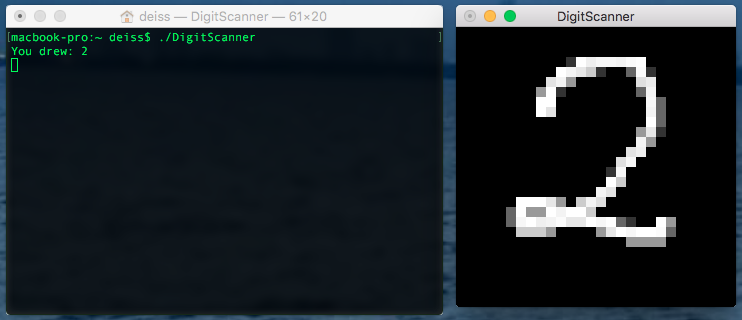

#### Project: DigitScanner 
#### Author: DEISS Olivier 

This project is a handwritten number recognition software, using a feedforward Artificial Neural Network (ANN). The network learns with the Stochastic Gradient Descent algorithm, using the cross-entropy as a cost function.

I was rather focused on understanding the principles of ANN in this project, so I coded the whole project myself and didn't use any libraries. You should consider using linear algebra librairies if you want greater performances.

Language: C++ 

-----------------------------------------------------------------------------------

-----------------------------------------------------------------------------------

With only one hidden layer, it is possible to achieve significant results on the MNIST testing set, using the 60000 digits from the training set. The MNIST digits are 28x28 black and white pictures. So I used 784 neurons for the input, 10 for the output (1 per digit), and between 30 and 200 neurons for the hidden layer. More neurons in the hidden layer can lead to better performances but also take longer to train.

With 200 neurons in the hidden layer, 14 epochs of training over the whole data set with batches of 10 pictures, up to 98.33% guesses were right on the testing set (10000 pictures). I used a learning rate of 0.1 and no weight decay to get these results. This Neural Network is stored in "dgs_params.txt".

-----------------------------------------------------------------------------------

C++ Functions:
   - 'save':  saves the neural network in a file
   - 'load':  loads a neural network from a file
   - 'train': use training data to update the weights and biases
   - 'test':  gives the output and score for a given testing set

Keys:
   - 'g': guess the number in the drawing area
   - 'r': reset the drawing area

