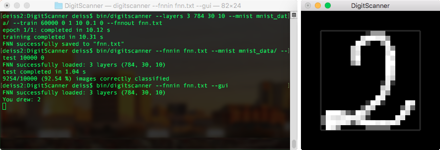
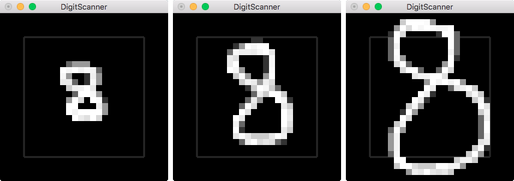

# DigitScanner

## PROJECT

DigitScanner is a C++ tool to create, train and test feedforward neural networks (fnn) for handwritten number recognition. The project uses the MNIST dataset to train and test the neural networks. It is also possible to draw numbers in a window and ask the tool to guess the number you drew.

The neural networks are taught with the Stochastic Gradient Descent algorithm, using the cross-entropy as a cost function. With only one hidden layer, it is possible to achieve significant results on the MNIST testing set, using the 60000 digits from the training set. The MNIST digits are 28x28 black and white pictures, so we need to use 784 neurons for the input, 10 for the output (1 per digit), and between 30 and 200 neurons for the hidden layer. More neurons in the hidden layer can lead to better performances but also take longer to train.

## LICENSE

DigitScanner - Copyright (C) 2016 -  Olivier Deiss

This program is free software: you can redistribute it and/or modify
it under the terms of the GNU General Public License as published by
the Free Software Foundation, either version 3 of the License, or
(at your option) any later version.

This program is distributed in the hope that it will be useful,
but WITHOUT ANY WARRANTY; without even the implied warranty of
MERCHANTABILITY or FITNESS FOR A PARTICULAR PURPOSE.  See the
GNU General Public License for more details.

You should have received [a copy of the GNU General Public License](COPYING)
along with this program. If not, see <http://www.gnu.org/licenses/>.

***

### Install

##### Linux

You need to have glut installed on your platform. You can install it with:

    apt-get install freeglut3 freeglut3-dev

Then running `make linux` will compile *DigitScanner* in *bin*. You can run `make clean` to delete the build directory.

##### Mac

You need to have XCode installed on your system. Then running `make mac` will compile *DigitScanner* in *bin*. You can run `make clean` to delete the build directory.

***

### Use

You can get a list of the parameters and options with:

    bin/digitscanner --help

You can start with the existing neural networks in the *fnn* directory and test them with the mnist dataset:

    bin/digitscanner --fnnin fnn/fnn_100.txt --test 10000 0 --mnist mnist_data
    
Or you can create a new neural network, with 784 neurons in input, a hidden layer of 50 neurons and an output layer of 10 neurons, and train it twice over the whole dataset with batches of 10 pictures and a learning factor of 0.1. Do not forget to save this neural network with the `--fnnout` parameter. The neural network available in *fnn/fnn_50.txt* has been created with the following command:

    bin/digitscanner --layers 3 784 50 10 --train 60000 0 2 10 0.1 0 --fnnout fnn_50.txt --mnist mnist_data
    
You can also try to see if adding another hidden layer will improve the test result. It may take a long time, so you can use the `--enable_multithreading` option and train it over only 20000 pictures to make the process quicker. Let's use the last 20000 pictures. You can use the `--time` option to see how long it takes to do the training. The neural network available in *fnn/fnn_100.txt* has been created with the following command:

    bin/digitscanner --layers 3 784 100 10 --train 20000 40000 1 10 0.1 0 --fnnout fnn_100.txt --mnist mnist_data --enable_multithreading 2 --time
    
Then you can load the previously created neural networks and test them:

    bin/digitscanner --fnnin fnn_100.txt --test 10000 0 --mnist mnist_data   # 88.64%
    bin/digitscanner --fnnin fnn_50.txt --test 10000 0 --mnist mnist_data    # 94.59%
    
So the second neural network with 100 neurons in the hidden layer did not do a really good job, but it has only been trained on 20000 pictures once. You can train it again:

    bin/digitscanner --fnnin fnn_100.txt --train 60000 0 20 5 0.1 0 --fnnout fnn_100_improved.txt --time --enable_multithreading 4 --mnist mnist_data
    
And test this last neural network:

    bin/digitscanner --fnnin fnn_100_improved.txt --test 10000 0 --mnist mnist_data   # 96.38%

It gives a better result. You can finally use the `--gui` option to display a window and draw numbers in it. Type `g` to guess the number and `r` to reset the drawing area.

    bin/digitscanner --fnnin fnn_100_improved.txt --gui
    
When using this option, try to draw the digit within the displayed box to obtain better results. Among the three digits below, only the middle one was correctly labeled by the `fnn/fnn_200_100_improved.txt` neural network.

    
Finally, let's try with two hidden layers and ten epochs:

    bin/digitscanner --layers 4 784 200 100 10 --train 60000 0 10 5 0.1 0 --fnnout fnn_200_100.txt --enable_multithreading 5 --time --mnist mnist_data
    bin/digitscanner --fnnin fnn_200_100.txt --test 10000 0 --mnist mnist_data   # 96.57 %
    
It gives good results but it is still not amazing. This is because it gets really hard to train. What if we do twenty more epochs:

    bin/digitscanner --train 60000 0 15 5 0.1 0 --fnnout fnn_200_100_improved.txt --fnnin fnn/fnn_200_100.txt --enable_multithreading 5 --time --mnist mnist_data
    bin/digitscanner --fnnin fnn_200_100_improved.txt --test 10000 0 --mnist mnist_data   # 98.25%
    
It is better but also shows that the training is really slow. This neural network is available in the *fnn* directory.

***
    
### File Format

The weights are multiplied to the inputs to give the outputs. The weight matrix *W* between two layers has *n* rows and *m* columns, where *m* is the number of nodes in the first layer and *n* is the number of nodes of the second layer. The bias matrix *B* is a *n*-dimension vector. Given an input vector *I*, a weight matrix *W*, a bias vector *B* and an output vector *O*, we have the following formula: *O* = *WA* + *B*. This output from the first layer is the input of the second layer.

Neural networks are stored as text files. Their structure is as follow:

    <number of layers>
    <number of nodes in first layer> ... <number of nodes in last layer >
    <weight matrix between first-second layers>
    <bias matrix between first-second layers>
    ...
    <weight matrix between penultimate-last layers>
    <bias matrix between penultimate-last layers>
    
The number of nodes in each layer are separated with spaces. The weight matrix *W* between the first layer (*m* nodes) and the second layer (*n* nodes) has the following structure:

    W(1, 1) W(1, 2) W(1, 3) ... W(1, m)
    W(2, 1) W(2, 2) W(2, 3) ... W(2, m)
    W(3, 1) W(3, 2) W(3, 3) ... W(3, m)
      ...     ...     ...   ...   ...
    W(n, 1) W(n, 2) W(n, 3) ... W(n, m)
    
The bias matrix *B* between the first layer (*m* nodes) and the second layer (*n* nodes) is written on one line:

    B(1, 1) B(1, 2) B(1, 3) ... B(1, n)

***
    
### Improvements

Many improvements can be brought to this project. First it would be possible to use a decent library for matrices. I just wanted to code a matrix class at least once in my life and this project was a great occasion to do so, but I guess it is not the most efficient one.

Then to improve the correctness and reach the 99.x% of correct guesses over the training set, it is possible to artificially increase the training set by copying/rotating/scaling the existing ones.

To correctly classify a few more images, the key is to implement a convolutional neural network.

***

### Contact

olivier . deiss [at] gmail . com
